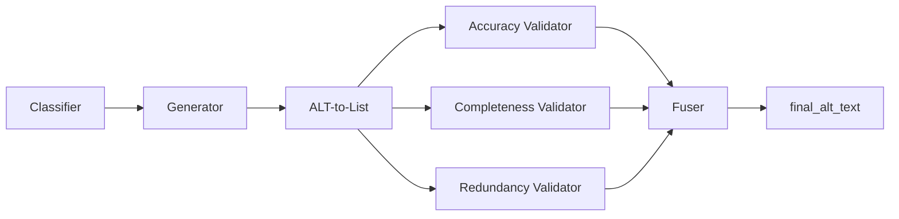

# ViGALT — Visual-Grounded ALT Text Generation

Research codebase for **ViGALT**, a multi-stage pipeline that generates high-quality, screen-reader-friendly alt text for e-commerce product images. The system takes a product image plus surrounding page text and produces objective, hallucination-filtered alt text through a 7-stage generate → deconstruct → validate → fuse pipeline.

This repository is the public release accompanying our research paper. It includes the full source code, prompts, product metadata, and the consolidated evaluation dataset with published results for **ViGALT** vs. the **ASSETS24** baseline.

## Pipeline Overview



Every product is classified as **CLOTHING** or **FURNITURE**. Stages 4–6 run in parallel; all other stages are sequential. See [docs/pipeline_architecture.md](docs/pipeline_architecture.md) for the full specification.

## Repository Layout

```
.
├── src/atsn/              Python package (pipeline + evaluators)
├── prompts/               Stage prompts and evaluation rubrics
├── data/products/         30 product JSON files (15 clothing, 15 furniture)
├── evaluation_dataset/    Published per-image results (30 folders + summary.json)
├── docs/                  Architecture documentation
├── scripts/               Batch run helpers (PowerShell)
├── pyproject.toml         Package metadata
├── requirements.txt       Pinned dependencies
└── .env.example           API key template
```

### `src/` structure

`src/` contains a single Python package, `atsn/`:

| Group | Modules |
|---|---|
| Pipeline core | `pipeline.py`, `pipeline_utils.py`, `pipeline_types.py` |
| Backends | `gemini_backend.py`, `gemini_browser.py`, `gemini_send.py`, `openai_*.py` |
| Evaluators | `*_evaluator_batch.py`, `combine_claims_relevancy.py`, `evaluator_batch_utils.py` |
| Dataset tools | `build_dataset.py`, `alt_to_list_batch.py` |

> **Note:** If you see `atsn.egg-info/` under `src/` after running `pip install -e .`, that is a local build artifact (already gitignored). Only `src/atsn/` is source code.

## Setup

```bash
python -m venv .venv
.venv\Scripts\activate          # Windows
# source .venv/bin/activate     # macOS/Linux
pip install -r requirements.txt
pip install -e .
playwright install chromium
```

Copy `.env.example` to `.env` and set your API key:

```
OPENAI_API_KEY=sk-...
```

## Reproducing Results

### What is already included

The `evaluation_dataset/` folder contains everything needed to **verify** the paper numbers:

| File per folder (`1/` … `30/`) | Contents |
|---|---|
| `<image>.jpg` | Product image |
| `dom.json` | Product metadata (title, brand, features, …) |
| `alt_text_and_claims.txt` | ViGALT and ASSETS24 alt text + plain claims |
| `evaluation.json` | Relevancy, redundancy, objectivity, efficiency metrics |

Top-level `evaluation_dataset/summary.json` holds averaged metrics across all 30 products.

### Re-running the pipeline (generates new alt text)

Requires a Google account (Gemini web UI) or OpenAI API key:

```bash
# Single product via OpenAI API
python -m atsn.pipeline --backend openai_api --product data/products/1_clothing.json

# All 30 products via Gemini web UI (manual login on first run)
python -m atsn.pipeline --all --keep-open
```

### Re-running evaluators

Evaluators use OpenAI API and expect pipeline outputs under `output/`:

```bash
python -m atsn.alt_to_list_batch --source pipeline --all
python -m atsn.relevancy_evaluator_batch
python -m atsn.redundancy_evaluator_batch
python -m atsn.objectivity_evaluator_batch
python -m atsn.efficiency_evaluator_batch
python -m atsn.combine_claims_relevancy
```

### Batch scripts

```powershell
.\scripts\run_clothing_6_15.ps1
.\scripts\run_furniture_16_30.ps1
```

## Evaluation Metrics

| Metric | Description |
|---|---|
| Relevancy | Whether each atomic claim is relevant (R), supplementary (S), or visual-only (V) |
| Redundancy | Novel vs. avoidable repetition relative to product DOM |
| Objectivity | Objective vs. subjective claim labels |
| Efficiency | `(relevant_novel_claims / ALT word count) × 100` |

## Dataset

- **30 products:** 15 clothing (`1_clothing` … `15_clothing`) and 15 furniture (`16_furniture` … `30_furniture`)
- Each product JSON in `data/products/` contains title, brand, description, feature bullets, and a `main_image` URL
- Product images are included in `evaluation_dataset/<N>/`
- Published evaluation results are in `evaluation_dataset/` with `summary.json` averages

## Citation

If you use this code or dataset in your research, please cite:

```bibtex
@article{vigalt2026,
  title   = {ViGALT: Visual-Grounded ALT Text Generation for E-Commerce Product Images},
  author  = {TODO: Add authors},
  journal = {TODO: Add venue},
  year    = {2026}
}
```

## License

MIT — see [LICENSE](LICENSE).
