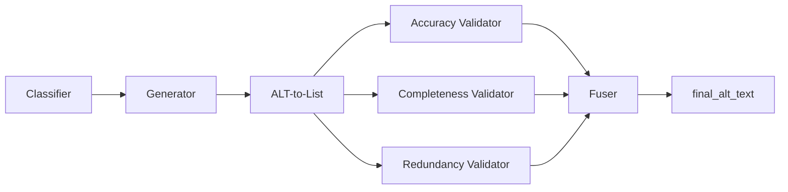

# ATSN — Accessible Alt-Text Generation Pipeline

Research codebase for generating high-quality, screen-reader-friendly **ALT text** for e-commerce product images. The system takes a product image plus surrounding page text and produces objective, hallucination-filtered ALT text through a 7-stage generate → deconstruct → validate → fuse pipeline.

## Pipeline Overview



Every product is classified as **CLOTHING** or **FURNITURE**. Stages 4–6 run in parallel; all other stages are sequential. See [docs/pipeline_architecture.md](docs/pipeline_architecture.md) for the full specification.

## Repository Layout

```
.
├── src/atsn/              Python package (pipeline + evaluators)
├── prompts/               Stage prompts and evaluation rubrics
├── data/
│   ├── products/          30 product JSON files (15 clothing, 15 furniture)
│   ├── images/            Local product images
│   └── ATSN_Dataset.xlsx  Research dataset (includes ASSEST24 baseline)
├── output/                Pipeline and evaluation results (committed)
├── Dataset/               Raw per-image source data (30 folders)
├── evaluation_dataset/    Consolidated per-image dataset (generated)
├── scripts/               Batch run helpers (PowerShell)
└── docs/                  Architecture documentation
```

## Setup

```bash
python -m venv .venv
.venv\Scripts\activate          # Windows
pip install -r requirements.txt
pip install -e .
playwright install chromium
```

Copy `.env.example` to `.env` and set your API key:

```
OPENAI_API_KEY=sk-...
```

## Usage

### Run the pipeline

```bash
# First product only (validation)
python -m atsn.pipeline

# Single product via OpenAI API
python -m atsn.pipeline --backend openai_api --product data/products/1_clothing.json

# All products via Gemini web UI
python -m atsn.pipeline --all --keep-open
```

### Extract claims from ALT text

```bash
python -m atsn.alt_to_list_batch --source pipeline --all
python -m atsn.alt_to_list_batch --source asset24 --all
```

### Run evaluators

```bash
python -m atsn.relevancy_evaluator_batch
python -m atsn.redundancy_evaluator_batch
python -m atsn.objectivity_evaluator_batch
python -m atsn.efficiency_evaluator_batch
python -m atsn.combine_claims_relevancy
```

### Build consolidated evaluation dataset

Generate `evaluation_dataset/` from the raw `Dataset/` folders (one folder per image with merged alt text, claims, and evaluations for **ViGALT** and **ASSETS24**, plus a top-level `summary.json` with averaged metrics):

```bash
python -m atsn.build_dataset
python -m atsn.build_dataset --source Dataset --output evaluation_dataset --force
```

Each output folder contains:

| File | Contents |
|---|---|
| `<image>.jpg` | Product image (copied) |
| `dom.json` | Product DOM |
| `alt_text_and_claims.txt` | Both methods' ALT text followed by plain claims (no relevancy labels) |
| `evaluation.json` | Relevancy, redundancy, objectivity, and efficiency for both methods |

### Batch scripts

```powershell
.\scripts\run_clothing_6_15.ps1
.\scripts\run_furniture_16_30.ps1
```

## Evaluation Metrics

Post-pipeline evaluators compare **our** pipeline output against the **ASSEST24** baseline:

| Metric | Description |
|---|---|
| Relevancy | Whether each atomic claim is relevant (R), supplementary (S), or visual-only (V) |
| Redundancy | Novel vs. avoidable repetition relative to product DOM |
| Objectivity | Objective vs. subjective claim labels |
| Efficiency | `(relevant_novel_claims / ALT word count) × 100` |

Results are stored under `output/` (`relevancy_evaluations.json`, `redundancy_evaluations.json`, etc.) and in the consolidated `evaluation_dataset/` (see above).

## Dataset

- **30 products:** 15 clothing (`1_clothing` … `15_clothing`) and 15 furniture (`16_furniture` … `30_furniture`)
- Each product JSON in `data/products/` contains title, brand, description, feature bullets, and a `main_image` URL
- Local images are cached in `data/images/` and `downloads/` (gitignored)
- Raw per-image research artifacts live in `Dataset/` (source for `evaluation_dataset/`)
- Consolidated per-image outputs are in `evaluation_dataset/` with `summary.json` averages

## Citation

If you use this code or dataset in your research, please cite:

```bibtex
@article{atsn2026,
  title   = {ATSN: Accessible Alt-Text Generation for E-Commerce Product Images},
  author  = {TODO: Add authors},
  journal = {TODO: Add venue},
  year    = {2026}
}
```

## License

MIT — see [LICENSE](LICENSE).
