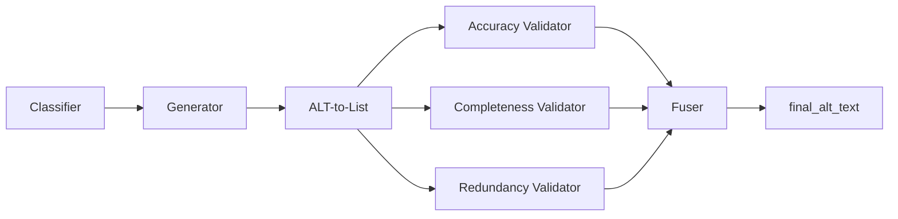

# ViGALT — Visual-Grounded ALT Text Generation

Research codebase for **ViGALT**, a multi-stage pipeline that generates high-quality, screen-reader-friendly alt text for e-commerce product images. The system takes a product image plus surrounding page text and produces objective, hallucination-filtered alt text through a 7-stage generate → deconstruct → validate → fuse pipeline.

This repository is the public release accompanying our research paper. It includes the full source code, prompts, and the consolidated evaluation dataset with published results for **ViGALT** vs. the **ASSETS24** baseline.

## Pipeline Overview



Every product is classified as **CLOTHING** or **FURNITURE**. Stages 4–6 run in parallel; all other stages are sequential. See [docs/pipeline_architecture.md](docs/pipeline_architecture.md) for the full specification.

## Repository Layout

```
.
├── src/atsn/              Python package (pipeline + evaluators)
├── prompts/               Stage prompts and evaluation rubrics
├── evaluation_dataset/    Published per-image results (30 folders + summary.json)
├── docs/                  Architecture documentation
├── output/                Generated runs (created when you execute the pipeline)
├── pyproject.toml         Package metadata
├── requirements.txt       Pinned dependencies
└── .env.example           API key template
```

### `src/atsn/` structure

```
src/atsn/
├── paths.py                 Stable project-root resolution
├── pipeline/                7-stage runner, utils, types
├── backend/                 OpenAI client, config, JSON schemas
├── extraction/              Amazon DOM scraper
├── evaluation/              Relevancy, redundancy, objectivity, efficiency evaluators
├── cli/                     extract_dom, run_from_url, build_dataset, combine_claims
└── *.py shims               Backward-compatible entry points (e.g. pipeline via package)
```

| Group | Location |
|---|---|
| Pipeline core | `pipeline/runner.py`, `pipeline/utils.py`, `pipeline/types.py` |
| Backend | `backend/openai.py`, `backend/config.py`, `backend/schemas.py` |
| DOM extraction | `cli/extract_dom.py`, `extraction/amazon.py` |
| Orchestration | `cli/run_from_url.py` |
| Evaluators | `evaluation/relevancy.py`, `redundancy.py`, `objectivity.py`, `efficiency.py`, `alt_to_list.py` |
| Dataset tools | `cli/build_dataset.py`, `cli/combine_claims.py` |

All documented `python -m atsn.*` commands still work via thin shims at the package root.

## Setup

```bash
python -m venv .venv
.venv\Scripts\activate          # Windows
# source .venv/bin/activate     # macOS/Linux
pip install -r requirements.txt
pip install -e .
```

Set your OpenAI API key (required for all LLM stages). Either copy `.env.example` to `.env` and fill in your key, or export it in the shell:

```powershell
# Option A: .env file (recommended)
copy .env.example .env
# Edit .env and set OPENAI_API_KEY=sk-...

# Option B: PowerShell (Windows)
$env:OPENAI_API_KEY = "sk-..."
```

```bash
# Option A: .env file (recommended)
cp .env.example .env
# Edit .env and set OPENAI_API_KEY=sk-...

# Option B: macOS/Linux
export OPENAI_API_KEY=sk-...
```

The `.env` file in the project root is loaded automatically when you run any `python -m atsn.*` command.

Default model for all stages is **`gpt-5.6-luna`** (configured in [`src/atsn/backend/config.py`](src/atsn/backend/config.py)). Override with `--single-model` on any command.

---

## Quick start: one Amazon URL → full run

Runs DOM extraction, alt-text generation, claim extraction, and all four evaluation metrics:

```bash
python -m atsn.run_from_url --url "https://www.amazon.fr/dp/B077XM3DV5"
```

Outputs go to `output/runs/B077XM3DV5/` (DOM JSON, image, evaluation JSONs). Pipeline output is saved to `output/B077XM3DV5_pipeline.json`.

Options:

```bash
python -m atsn.run_from_url --url "..." --work-dir output/runs/my_product
python -m atsn.run_from_url --html saved_page.html --work-dir output/runs/B077XM3DV5
python -m atsn.run_from_url --url "..." --skip-eval          # pipeline only
python -m atsn.run_from_url --url "..." --single-model gpt-5.6-luna
```

---

## Step-by-step guide

### Step 1 — Extract product DOM + image

Build a product JSON from an Amazon URL. Downloads the main product image into the same folder.

```bash
python -m atsn.extract_dom \
  --url "https://www.amazon.fr/dp/B077XM3DV5" \
  --output-dir output/runs/B077XM3DV5
```

Creates:
- `output/runs/B077XM3DV5/B077XM3DV5.json` — title, brand, description, feature bullets, product details, `main_image`
- `output/runs/B077XM3DV5/B077XM3DV5.jpg` — downloaded product image

If Amazon blocks automated requests, save the page HTML in your browser and parse locally:

```bash
python -m atsn.extract_dom --html saved_page.html --output-dir output/runs/B077XM3DV5
```

You can also use a product JSON from the paper dataset: `evaluation_dataset/1/dom.json` (each folder `1/` … `30/` contains metadata for one product).

### Step 2 — Generate alt text (7 pipeline stages)

One command runs all generation stages via OpenAI:

| Order | Stage | Prompt | Input |
|---|---|---|---|
| 1 | Classifier | `prompts/classifier.txt` | image + surrounding text |
| 2 | Generator | `prompts/clothing_generator.txt` or `furniture_generator.txt` | image + surrounding text |
| 3 | Claim extraction | `prompts/alt_to_list.txt` | generated alt text |
| 4 | Accuracy validator | `prompts/accuracy_validator.txt` | image + claims |
| 5 | Completeness validator | `prompts/completeness_validator.txt` | image + claims |
| 6 | Redundancy validator | `prompts/redundancy_validator.txt` | image + claims |
| 7 | Fuser | `prompts/fuser.txt` | validator outputs |

```bash
python -m atsn.pipeline --product output/runs/B077XM3DV5/B077XM3DV5.json
```

Or with a paper-dataset product:

```bash
python -m atsn.pipeline --product evaluation_dataset/1/dom.json
```

Output: `output/<stem>_pipeline.json` with `final_alt_text` and per-stage results.

### Step 3 — Extract claims (evaluation format)

The pipeline already runs claim extraction inline (stage 3). This step re-extracts claims into the batch format used by evaluators:

```bash
python -m atsn.alt_to_list_batch \
  --source pipeline \
  --pipeline output/B077XM3DV5_pipeline.json \
  --output-dir output/runs/B077XM3DV5/final_alt_claim_lists
```

Output: `output/runs/B077XM3DV5/final_alt_claim_lists/B077XM3DV5_claims.json`

### Step 4 — Relevancy evaluation

```bash
python -m atsn.relevancy_evaluator_batch \
  --algorithm our \
  --our-claims-dir output/runs/B077XM3DV5/final_alt_claim_lists \
  --products-dir output/runs/B077XM3DV5 \
  --images-dir output/runs/B077XM3DV5 \
  --output output/runs/B077XM3DV5/relevancy_evaluations.json
```

Prompt: `prompts/evaluators/relevancy.txt`

### Step 5 — Redundancy evaluation

```bash
python -m atsn.redundancy_evaluator_batch \
  --algorithm our \
  --relevancy-input output/runs/B077XM3DV5/relevancy_evaluations.json \
  --products-dir output/runs/B077XM3DV5 \
  --output output/runs/B077XM3DV5/redundancy_evaluations.json
```

Prompt: `prompts/evaluators/redundancy.txt`

### Step 6 — Objectivity evaluation

```bash
python -m atsn.objectivity_evaluator_batch \
  --algorithm our \
  --relevancy-input output/runs/B077XM3DV5/relevancy_evaluations.json \
  --products-dir output/runs/B077XM3DV5 \
  --images-dir output/runs/B077XM3DV5 \
  --output output/runs/B077XM3DV5/objectivity_evaluations.json
```

Prompt: `prompts/evaluators/objectivity.txt`

### Step 7 — Efficiency evaluation

Deterministic metric (no LLM): `(relevant_novel_claims / ALT word count) × 100`

```bash
python -m atsn.efficiency_evaluator_batch \
  --algorithm our \
  --redundancy-input output/runs/B077XM3DV5/redundancy_evaluations.json \
  --relevancy-input output/runs/B077XM3DV5/relevancy_evaluations.json \
  --output output/runs/B077XM3DV5/efficiency_evaluations.json
```

---

## Paper dataset (30 products)

### What is included

The `evaluation_dataset/` folder contains everything needed to **verify** the paper numbers:

| File per folder (`1/` … `30/`) | Contents |
|---|---|
| `dom.json` | Product metadata (title, brand, features, `main_image` URL, …) |
| `alt_text_and_claims.txt` | ViGALT and ASSETS24 alt text + plain claims |
| `evaluation.json` | Relevancy, redundancy, objectivity, efficiency metrics |

Top-level `evaluation_dataset/summary.json` holds averaged metrics across all 30 products.

- **30 products:** folders `1/` … `30/` (15 clothing, 15 furniture)
- Product JSONs live at `evaluation_dataset/N/dom.json` — not in a separate `data/` folder
- Images are referenced by URL in `dom.json`; the pipeline downloads them on first run

### Re-run pipeline on a paper product

```bash
python -m atsn.pipeline --product evaluation_dataset/1/dom.json
python -m atsn.pipeline --product evaluation_dataset/1/dom.json --single-model gpt-5.6-luna
```

To process all 30 products, run the pipeline once per folder (or use a shell loop over `evaluation_dataset/*/dom.json`).

### Verify published metrics

Compare your outputs to the pre-computed files in `evaluation_dataset/N/evaluation.json` and the averages in `evaluation_dataset/summary.json`. No re-run is required to check the paper numbers.

---

## Evaluation Metrics

| Metric | Description |
|---|---|
| Relevancy | Whether each atomic claim is relevant (R), supplementary (S), or visual-only (V) |
| Redundancy | Novel vs. avoidable repetition relative to product DOM |
| Objectivity | Objective vs. subjective claim labels |
| Efficiency | `(relevant_novel_claims / ALT word count) × 100` |

## Notes

- Amazon DOM extraction may be blocked by bot detection; use `--html` with a saved page when needed. Scraping is your responsibility under Amazon's terms of service.
- Re-running the pipeline produces new alt texts; LLM outputs vary. Use `evaluation_dataset/` to verify published paper numbers.
- If you see `atsn.egg-info/` under `src/` after `pip install -e .`, that is a local build artifact (gitignored).

## Citation

If you use this code or dataset in your research, please cite:

```bibtex
@article{vigalt2026,
  title   = {ViGALT: Visual-Grounded ALT Text Generation for E-Commerce Product Images},
  author  = {TODO: Add authors},
  journal = {TODO: Add venue},
  year    = {2026}
}
```

## License

MIT — see [LICENSE](LICENSE).
